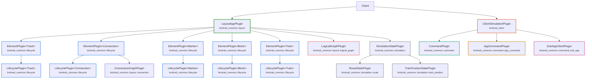

```mermaid
flowchart TD
    n0["Client"]
    n1["LayoutAppPlugin<br/><small>brickrail_common::layout</small>"]
    n2["ElementPlugin#lt;Track#gt;<br/><small>brickrail_common::lifecycle</small>"]
    n3["LifecyclePlugin#lt;Track#gt;<br/><small>brickrail_common::lifecycle</small>"]
    n4["ElementPlugin#lt;Connection#gt;<br/><small>brickrail_common::lifecycle</small>"]
    n5["LifecyclePlugin#lt;Connection#gt;<br/><small>brickrail_common::lifecycle</small>"]
    n6["ConnectionGraphPlugin<br/><small>brickrail_common::layout::connection</small>"]
    n7["ElementPlugin#lt;Marker#gt;<br/><small>brickrail_common::lifecycle</small>"]
    n8["LifecyclePlugin#lt;Marker#gt;<br/><small>brickrail_common::lifecycle</small>"]
    n9["ElementPlugin#lt;Block#gt;<br/><small>brickrail_common::lifecycle</small>"]
    n10["LifecyclePlugin#lt;Block#gt;<br/><small>brickrail_common::lifecycle</small>"]
    n11["ElementPlugin#lt;Train#gt;<br/><small>brickrail_common::lifecycle</small>"]
    n12["LifecyclePlugin#lt;Train#gt;<br/><small>brickrail_common::lifecycle</small>"]
    n13["LogicalGraphPlugin<br/><small>brickrail_common::layout::logical_graph</small>"]
    n14["SimulationStatePlugin<br/><small>brickrail_common::simulation</small>"]
    n15["RouteStatePlugin<br/><small>brickrail_common::simulation::route</small>"]
    n16["TrainPositionStatePlugin<br/><small>brickrail_common::simulation::train_position</small>"]
    n17["ClientSimulationPlugin<br/><small>brickrail_client</small>"]
    n18["CommandPlugin<br/><small>brickrail_common::command</small>"]
    n19["AppCommandPlugin<br/><small>brickrail_common::command::app_command</small>"]
    n20["SubAppClientPlugin<br/><small>brickrail_common::command::sub_app</small>"]

    n0 --> n1
    n1 --> n2
    n2 --> n3
    n1 --> n4
    n4 --> n5
    n4 --> n6
    n1 --> n7
    n7 --> n8
    n1 --> n9
    n9 --> n10
    n1 --> n11
    n11 --> n12
    n1 --> n13
    n1 --> n14
    n14 --> n15
    n14 --> n16
    n0 --> n17
    n17 --> n18
    n17 --> n19
    n17 --> n20

    classDef m0 stroke:#3987e5,stroke-width:2px
    classDef m1 stroke:#d95926,stroke-width:2px
    classDef m2 stroke:#199e70,stroke-width:2px
    classDef m3 stroke:#c98500,stroke-width:2px
    classDef m4 stroke:#d55181,stroke-width:2px
    classDef m5 stroke:#008300,stroke-width:2px
    classDef m6 stroke:#9085e9,stroke-width:2px
    classDef m7 stroke:#e66767,stroke-width:2px
    classDef mOther stroke:#8a8a85,stroke-width:2px
    class n2,n3,n4,n5,n7,n8,n9,n10,n11,n12 m0
    class n17 m1
    class n18 m2
    class n19 m3
    class n20 m4
    class n1 m5
    class n6 m6
    class n13 m7
    class n14 mOther
    class n15 mOther
    class n16 mOther
```
