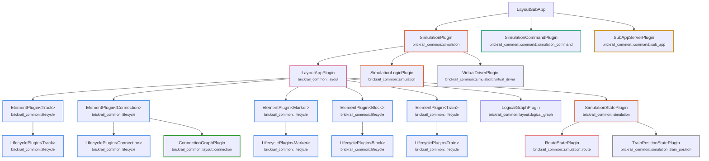

```mermaid
flowchart TD
    n0["LayoutSubApp"]
    n1["SimulationPlugin<br/><small>brickrail_common::simulation</small>"]
    n2["LayoutAppPlugin<br/><small>brickrail_common::layout</small>"]
    n3["ElementPlugin#lt;Track#gt;<br/><small>brickrail_common::lifecycle</small>"]
    n4["LifecyclePlugin#lt;Track#gt;<br/><small>brickrail_common::lifecycle</small>"]
    n5["ElementPlugin#lt;Connection#gt;<br/><small>brickrail_common::lifecycle</small>"]
    n6["LifecyclePlugin#lt;Connection#gt;<br/><small>brickrail_common::lifecycle</small>"]
    n7["ConnectionGraphPlugin<br/><small>brickrail_common::layout::connection</small>"]
    n8["ElementPlugin#lt;Marker#gt;<br/><small>brickrail_common::lifecycle</small>"]
    n9["LifecyclePlugin#lt;Marker#gt;<br/><small>brickrail_common::lifecycle</small>"]
    n10["ElementPlugin#lt;Block#gt;<br/><small>brickrail_common::lifecycle</small>"]
    n11["LifecyclePlugin#lt;Block#gt;<br/><small>brickrail_common::lifecycle</small>"]
    n12["ElementPlugin#lt;Train#gt;<br/><small>brickrail_common::lifecycle</small>"]
    n13["LifecyclePlugin#lt;Train#gt;<br/><small>brickrail_common::lifecycle</small>"]
    n14["LogicalGraphPlugin<br/><small>brickrail_common::layout::logical_graph</small>"]
    n15["SimulationStatePlugin<br/><small>brickrail_common::simulation</small>"]
    n16["RouteStatePlugin<br/><small>brickrail_common::simulation::route</small>"]
    n17["TrainPositionStatePlugin<br/><small>brickrail_common::simulation::train_position</small>"]
    n18["SimulationLogicPlugin<br/><small>brickrail_common::simulation</small>"]
    n19["VirtualDriverPlugin<br/><small>brickrail_common::simulation::virtual_driver</small>"]
    n20["SimulationCommandPlugin<br/><small>brickrail_common::command::simulation_command</small>"]
    n21["SubAppServerPlugin<br/><small>brickrail_common::command::sub_app</small>"]

    n0 --> n1
    n1 --> n2
    n2 --> n3
    n3 --> n4
    n2 --> n5
    n5 --> n6
    n5 --> n7
    n2 --> n8
    n8 --> n9
    n2 --> n10
    n10 --> n11
    n2 --> n12
    n12 --> n13
    n2 --> n14
    n2 --> n15
    n15 --> n16
    n15 --> n17
    n1 --> n18
    n1 --> n19
    n0 --> n20
    n0 --> n21

    classDef m0 stroke:#3987e5,stroke-width:2px
    classDef m1 stroke:#d95926,stroke-width:2px
    classDef m2 stroke:#199e70,stroke-width:2px
    classDef m3 stroke:#c98500,stroke-width:2px
    classDef m4 stroke:#d55181,stroke-width:2px
    classDef m5 stroke:#008300,stroke-width:2px
    classDef m6 stroke:#9085e9,stroke-width:2px
    classDef m7 stroke:#e66767,stroke-width:2px
    classDef mOther stroke:#8a8a85,stroke-width:2px
    class n3,n4,n5,n6,n8,n9,n10,n11,n12,n13 m0
    class n1,n15,n18 m1
    class n20 m2
    class n21 m3
    class n2 m4
    class n7 m5
    class n14 m6
    class n16 m7
    class n17 mOther
    class n19 mOther
```
